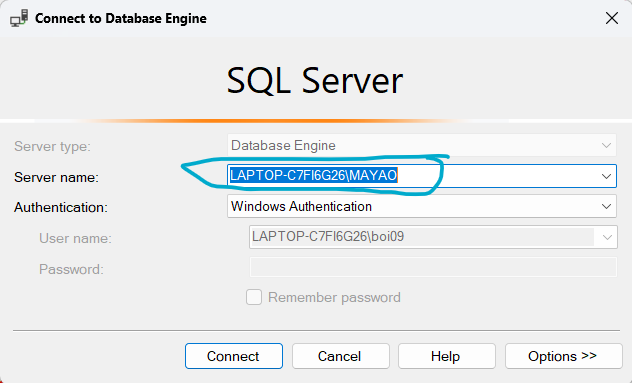

# QLQN
## Giới thiệu
- Project này mình tạo ra để cho vui thử Server-Client bên C#
- Có thể tham khảo code nếu muốn
## Hướng dẫn cài đặt
1. Chạy file SQL
- Đầu tiền tạo database QLQN trong file SQL trước để có database,table với bản ghi (file QLQN.sql) mình dùng SQL Server

- Lấy thông tin server name 

2. Khởi động Project và kết nối SQL
- Vào thư mục QUANLYQUANNETSQL
- Chọn mục thứ 3 của project

- Nhấn tổ hợp phím Ctrl+Alt+S để vào Server Explorer
- Chọn biểu tượng màu xanh như ảnh dưới đây

- Từ thông tin Server name đã lưu ở trên gán vào ô Server name bên dưới 

- Sau khi đã nhập Server name xong thì sẽ hiện ô này 

- Lúc này chỉ cần chọn “QLQN” là xong 

- Tiếp theo lấy Connection string từ SQL bạn đã kết nối, bên Server Explorer hãy nhấp vào SQL bạn đã kết nối ở trên như 

- Lúc này sẽ xuất hiện đoạn Connection string ở chỗ properties bên góc bên phải dưới cùng

- Copy hết đoạn Connection string
- Đầy đủ sẽ như sau : Data Source=LAPTOP-C7FI6G26\MAYAO;Initial Catalog=QLQN;Integrated Security=True 
- Cái Data Source là cái server name bạn đã lưu 

- Bên menu Solution Explorer

- Chọn properties -> (double click) settings.settings
- Hiện lên được bảng này

- Bỏ đoạn Connection string khi kết nối sql vào “QLQNConnection” và “Str” lưu ý dòng Str có thêm đoạn này MultipleActiveResultSets=true

Nguyên văn đoạn string sẽ như sau :

Str : Data Source=LAPTOP-C7FI6G26\MAYAO;Initial Catalog=QLQN;Integrated Security=True;MultipleActiveResultSets=true

QLQNConnection : Data Source=LAPTOP-C7FI6G26\MAYAO;Initial Catalog=QLQN;Integrated Security=True

- Vậy là chạy được project rồi. Chúc bạn thành công
## Hướng dẫn sử dụng
- Chạy server trước rồi chạy client sau

